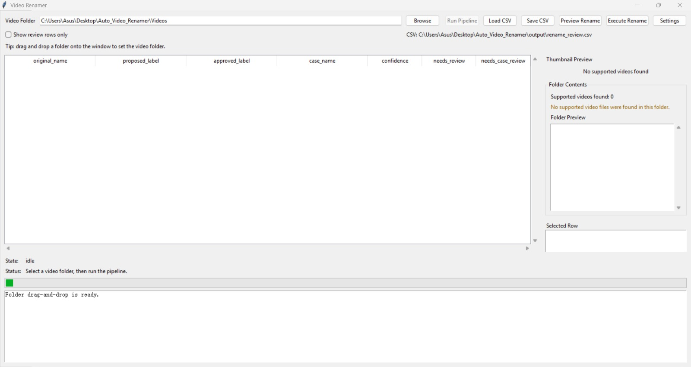

# Video Renamer

Windows-friendly Tkinter desktop app for **clustering, reviewing, and renaming short videos with Gemini-assisted labels**.

The application analyzes representative frames from videos, generates AI filename suggestions using Google Gemini, and allows users to review and batch rename files through an intuitive desktop interface.

---

# Main Interface



The main interface is where users run the entire renaming workflow.

### Step 1 — Configure API Key

Click **Settings** in the top-right corner and enter your **Gemini API key**.

You can also configure:

- Gemini model name
- Default input folder
- Default output folder

The application reads runtime settings from `config.json`.

---

### Step 2 — Select Video Folder

Click **Browse** and select the folder containing your videos.

The application will scan the folder and show:

- supported video files
- number of detected videos
- folder preview information

The project uses **`Videos/` as the neutral default input folder**, but you can select any folder.

---

### Step 3 — Run Pipeline

Click **Run Pipeline** to process the videos.

The pipeline performs several automated steps:

1. Cluster similar videos  
2. Extract representative frames  
3. Send frames to Gemini for labeling  
4. Generate a review table  

After the pipeline finishes, the table will populate with suggested labels.

---

### Step 4 — Review Labels

Each row in the table represents one video.

| Column | Description |
|------|------|
| **original_name** | Original video filename |
| **proposed_label** | AI-generated label suggestion |
| **approved_label** | Editable label chosen by the user |
| **case_name** | Group identifier used for numbering |
| **confidence** | AI confidence score |
| **needs_review** | Indicates if the label may need manual review |

Users can modify **approved_label** and **case_name** before renaming.

---

### Case-based numbering system

Videos can be grouped using the `case_name` column.

Example:

```
1.0_head_massage.mp4
1.1_head_massage.mp4
1.2_head_massage.mp4
2.0_neck_massage.mp4
```

This allows users to organize related clips while keeping filenames structured.

---

# Setup

1. Copy `config.example.json` to `config.json`.

2. Open `config.json` and paste your Gemini API key into:

```
gemini_api_key
```

3. Optionally change the default input and output folders.

The project uses `Videos` as the neutral default input folder.

4. Install dependencies:

```
pip install -r requirements.txt
```

5. Run the application:

```
python app.py
```

---

# Workflow

1. Choose any folder that contains short video files.

2. Run the pipeline to:

- cluster similar videos  
- extract representative frames  
- label cluster representatives with Gemini  
- generate `rename_review.csv`

3. Review or edit labels in the GUI or CSV.

4. Preview the rename plan.

5. Execute the rename operation.

---

# Build Executable

1. Open a Command Prompt in this project folder.

2. Install PyInstaller if needed:

```
pip install pyinstaller
```

3. Run the build script:

```
build_exe.bat
```

4. After the build finishes, the executable will be available at:

```
dist\VideoRenamer.exe
```

---

# Notes

- The build uses PyInstaller with `--onefile`, `--windowed`, and `--name VideoRenamer`.
- Runtime folders are created automatically when the app starts if they are missing:

```
output/
frames/
thumbs/
```

- `config.json` is for **local runtime settings only** and is ignored by Git.
- When packaged, the application still reads and writes `config.json` beside `VideoRenamer.exe`.
- The default sample input folder is `Videos`, but you can point the app at **any video folder**.

---

# License

MIT License

---

# Author

Zhe Yee Tan  
GitHub: https://github.com/ZheYee03
